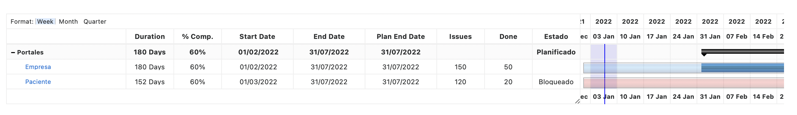
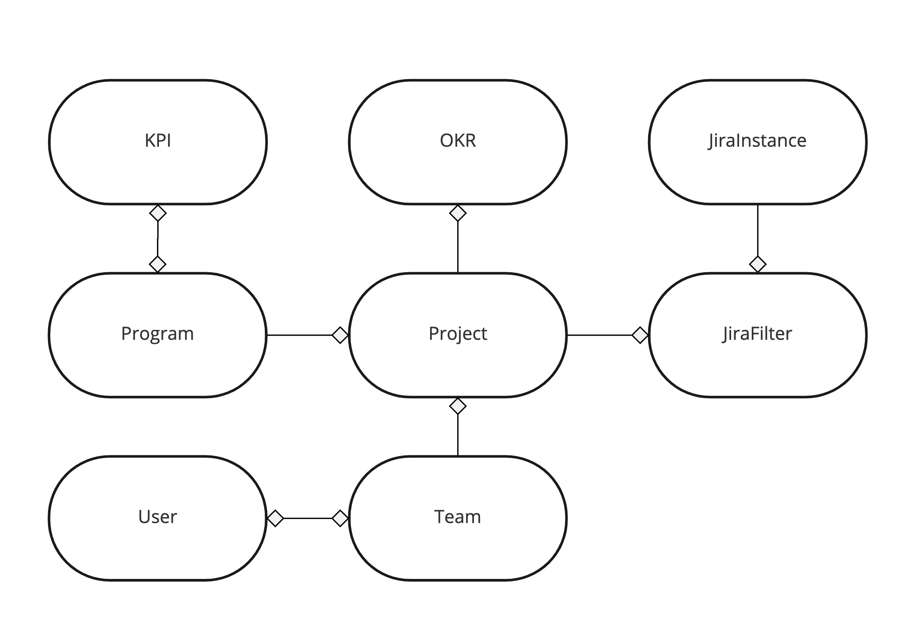

# Project Office

The development of this product seeks to have a project office through the use of the power of JIRA.

## Domain

## Guide
- [Docker](docs/DOCKER.md)
- [Quarkus](docs/QUARKUS.md)
- [Related guides](docs/GUIDES.md)
- [Provided code](docs/PROVIDEDCODE.md)

## Running the application in dev mode
1. Start docker
```shell script
$ docker-compose up
```
2. Run the application 
```shell script
$ ./gradlew quarkusDev
```

> **_NOTE:_**  Quarkus now ships with a Dev UI, which is available in dev mode only at http://localhost:8080/q/dev/.

